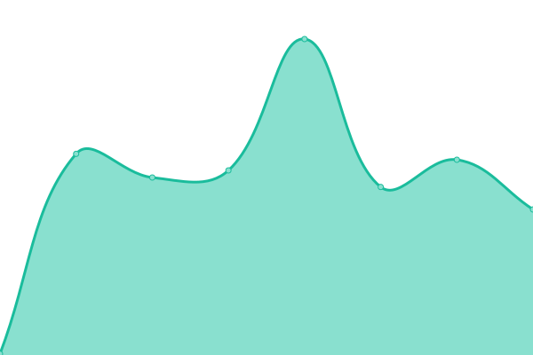

# [📈 Live Status](https://demo.upptime.js.org): <!--live status--> **🟧 Partial outage**

This repository contains the open-source uptime monitor and status page for [BryanOsvaldo](https://demo.upptime.js.org), powered by [Upptime](https://github.com/upptime/upptime).

With [Upptime](https://upptime.js.org), you can get your own unlimited and free uptime monitor and status page, powered entirely by a GitHub repository. We use [Issues](https://github.com/BryanOsvaldo/status/issues) as incident reports, [Actions](https://github.com/BryanOsvaldo/status/actions) as uptime monitors, and [Pages](https://demo.upptime.js.org) for the status page.

<!--start: status pages-->
<!-- This summary is generated by Upptime (https://github.com/upptime/upptime) -->
<!-- Do not edit this manually, your changes will be overwritten -->
<!-- prettier-ignore -->
| URL | Status | History | Response Time | Uptime |
| --- | ------ | ------- | ------------- | ------ |
|  [version.do (Landing Page)](https://version.do/) | 🟩 Up | [version-do-landing-page.yml](https://github.com/version-do/status/commits/HEAD/history/version-do-landing-page.yml) | 

 643ms
     
 | 

<a href="https://version-do.github.io/status/history/version-do-landing-page">100.00%</a>
    

|  [De Par en Par (DEV Server)](https://dev.deparenpar.edu.do) | 🟩 Up | [de-par-en-par-dev-server.yml](https://github.com/version-do/status/commits/HEAD/history/de-par-en-par-dev-server.yml) | 

 305ms
     
 | 

<a href="https://version-do.github.io/status/history/de-par-en-par-dev-server">100.00%</a>
    

|  [De Par en Par (QA Server)](https://qa.deparenpar.edu.do) | 🟩 Up | [de-par-en-par-qa-server.yml](https://github.com/version-do/status/commits/HEAD/history/de-par-en-par-qa-server.yml) | 

 298ms
     
 | 

<a href="https://version-do.github.io/status/history/de-par-en-par-qa-server">100.00%</a>
    

|  [De Par en Par (UAT Server)](https://uat.deparenpar.edu.do) | 🟥 Down | [de-par-en-par-uat-server.yml](https://github.com/version-do/status/commits/HEAD/history/de-par-en-par-uat-server.yml) | 

 0ms
     
 | 

<a href="https://version-do.github.io/status/history/de-par-en-par-uat-server">0.00%</a>
    

|  [De Par en Par (Production Server)](https://red.deparenpar.edu.do) | 🟩 Up | [de-par-en-par-production-server.yml](https://github.com/version-do/status/commits/HEAD/history/de-par-en-par-production-server.yml) | 

 216ms
     
 | 

<a href="https://version-do.github.io/status/history/de-par-en-par-production-server">100.00%</a>
    

|  [KuRa (Production Server)](https://kura.epsi.com.do/) | 🟩 Up | [ku-ra-production-server.yml](https://github.com/version-do/status/commits/HEAD/history/ku-ra-production-server.yml) | 

 308ms
     
 | 

<a href="https://version-do.github.io/status/history/ku-ra-production-server">100.00%</a>
    

<!--end: status pages-->

[**Visit our status website →**](https://demo.upptime.js.org)

## 📄 License

- Powered by: [Upptime](https://github.com/upptime/upptime)
- Code: [MIT](./LICENSE) © [BryanOsvaldo](https://demo.upptime.js.org)
- Data in the `./history` directory: [Open Database License](https://opendatacommons.org/licenses/odbl/1-0/)
